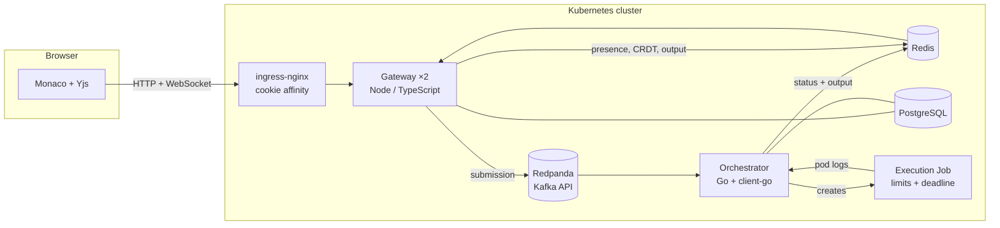

# CodeArena

A collaborative code editor where two people edit the same file at once and run it — and
the code executes for real inside an isolated, resource-limited Kubernetes Job, not a
simulated sandbox.

Three services in two languages, deployed to Kubernetes.

---

## What it does

- **Two people edit one file simultaneously.** Edits merge without conflicts or lost
  work using a CRDT (Yjs), with each participant's cursor visible to the other.
- **Code runs in a real Kubernetes Job** — a fresh container per submission, with CPU and
  memory limits, no network, no service-account token, a read-only filesystem, and a hard
  execution deadline.
- **Output streams live to both participants** as the program produces it, with status
  moving QUEUED → RUNNING → COMPLETED / FAILED / TIMEOUT for both of them.
- **An infinite loop is killed by the platform** at its deadline, with no retries, while
  other submissions run unaffected.

## Architecture



**Why the Go service owns Kubernetes:** `client-go` is the first-class, watch-aware
Kubernetes client, and a public-facing WebSocket server has no business holding
credentials that can create workloads. The gateway runs with
`automountServiceAccountToken: false` and cannot reach the API server at all.

| Service | Language | Responsibility |
|---|---|---|
| `services/gateway` | TypeScript / Node | Auth, sessions, WebSocket transports, Kafka producer, event relay |
| `services/orchestrator` | Go | Kafka consumer, Kubernetes Job lifecycle, log capture, results |
| `web` | React / Monaco | Collaborative editor, presence, live output |

## Running it

Requires Docker, [kind](https://kind.sigs.k8s.io/), kubectl, and Node 24+.

```bash
./infra/deploy.sh
```

That builds five images, loads them into a kind cluster, applies the manifests, runs
migrations, and waits for every rollout. Then open **http://localhost:8081**.

To tear it all down:

```bash
kind delete cluster --name codearena
```

## Demo

1. Open http://localhost:8081, register, and **Start a session**. Copy the session id.
2. In a **private window** (a separate `localStorage`, so it is a different user),
   register again and join with that id.
3. Type in both tabs at once — text merges, and each shows the other's cursor.
4. Paste this and press **Run**. Both tabs watch the lines appear one at a time:

   ```python
   import time
   for i in range(6):
       print(f"tick {i}", flush=True)
       time.sleep(0.4)
   ```

5. Now the closing move — replace it with an infinite loop and press **Run**:

   ```python
   while True:
       print("still going", flush=True)
   ```

   Both tabs stream output for ten seconds, then the status flips to **TIMEOUT**.
   `kubectl get jobs -n codearena-exec` shows exactly one pod for it, and no retries.

## Design decisions

**The guest seat is claimed with a conditional `UPDATE`.** Every precondition lives in
the `WHERE` clause, so Postgres decides the winner when two people join at once. A
read-then-write leaves a window where both observe an empty seat.

**Submissions are keyed by session id in Kafka.** Kafka orders within a partition, so one
session's runs are consumed in order while different sessions spread across partitions.

**The endpoint returns 202, not 200.** The claim is "durably queued", true only after the
broker acknowledges the record — not "this has run".

**Logs are followed during execution, not read after it.** When a Job exceeds its
deadline the controller deletes the pod, taking its logs with it. Following from the
moment the pod starts is why a timed-out run still has output.

**`terminationGracePeriodSeconds` is 5, not the default 30.** The container's process is
PID 1, and PID 1 ignores signals it has no handler for — so a 10-second deadline became a
40-second kill until this was set.

**The ingress pins a browser to one gateway replica.** A submission's code is read from
that replica's in-memory document, so the WebSocket and the POST must reach the same pod.
WebSockets need affinity anyway.

## Testing

81 automated tests, run against real PostgreSQL, Redis, Redpanda, and Kubernetes — no
mocks — including a concurrent-join race, cross-process CRDT convergence, and assertions
that the execution sandbox cannot be weakened.

```bash
cd services/gateway   && npm test    # 68 tests
cd services/orchestrator && go test ./...   # 13 tests, incl. the Job security posture
```

Four proof scripts demonstrate the properties end to end against a running system:

```bash
npm run proof          # presence: two participants in one session
npm run proof:collab   # 300 simultaneous edits, zero lost work, across two gateways
npm run proof:burst    # 200 submissions accepted with no consumer attached
npm run proof:exec     # sandbox limits, and the infinite-loop kill
npm run proof:stream   # output streaming live to a participant who did not submit
```

## What this does not do

Stated plainly, because the gaps are real:

- **No judging.** There are no problems, test cases, or verdicts — it executes code and
  shows the output. The "judge" in the original brief is not built.
- **One file per session.** No file tree, no terminal, no debugger, no dependency
  installation.
- **Python has syntax highlighting only.** Monaco ships a TypeScript language service,
  not a Python one.
- **Network egress is not blocked locally.** The `NetworkPolicy` is correct, but kind's
  default CNI does not enforce NetworkPolicy — this is only enforced on a cluster whose
  CNI implements it.
- **Not deployed to a cloud.** It runs on local Kubernetes; the manifests are written to
  move to EKS but that has not been done.

## Repository layout

```
infra/
  kind/          cluster definition
  k8s/           namespace, datastores, deployments, RBAC, ingress
  images/        per-language execution images
  deploy.sh      build, load, apply, wait
services/gateway/       TypeScript API and WebSocket transports
services/orchestrator/  Go Kafka consumer and Kubernetes executor
web/                    React frontend
```
